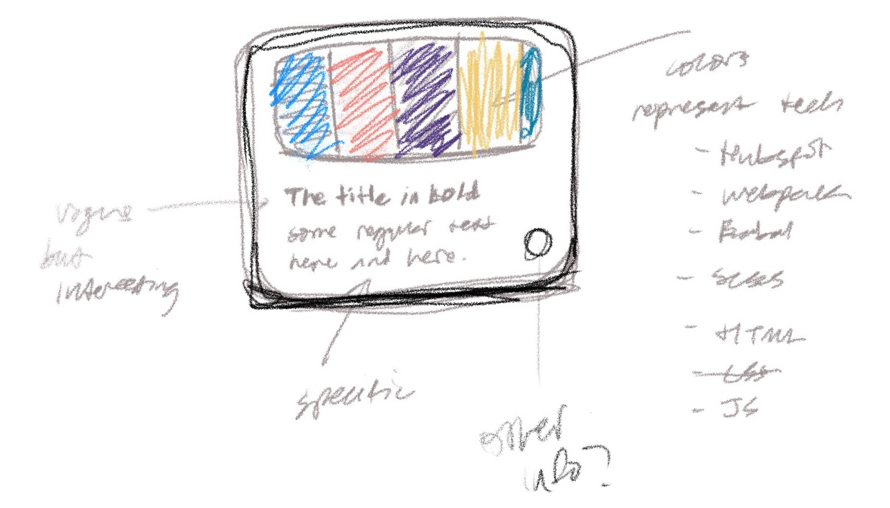

--- 
title: Colorful thumbnail React component
image: ./thumb-4.png
imageAlt: Gatsby
description: Outlining the idea and then figuring out how to build it in React
embeddedImagesLocal:
  - concept.jpeg
---

import { getImage, GatsbyImage } from 'gatsby-plugin-image';

## Concept

Use strips of color to represent the technologies mentioned in each post instead of using traditional thumbnail images. In the first version, the colors and technologies can be manually entered. In a future version, the smart thumbnail should be able to figure it out.

It definitely makes sense to build this in React. 

### Open questions
1. should I generate an SVG? 
2. does it need to animate?

### Steps to think about

1. make a list of each technology
2. assign a color for each
3. mockup an image in various scenarios
4. create a regular html/css element 
5. convert it into a React component
6. ???